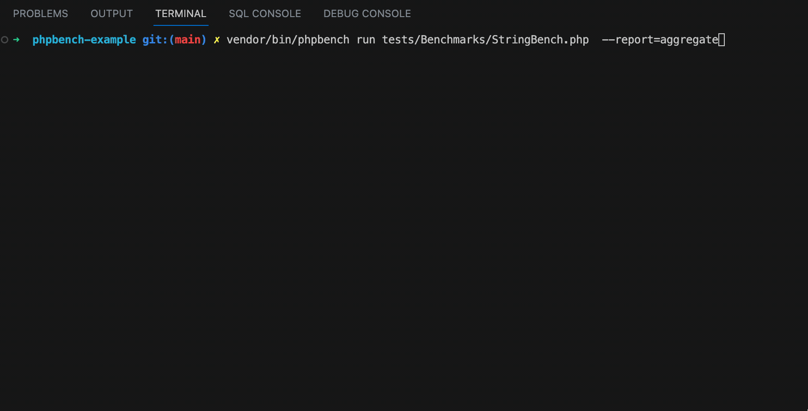

# Overview

An example project that benchmarks the performance of functions and methods using [PHPBench](https://github.com/phpbench/phpbench).

  

## Usage

Install dependencies

    composer install

Run all the benchmarks

    vendor/bin/phpbench run tests/Benchmarks --report=aggregate

Run a single benchmark case

    vendor/bin/phpbench run tests/Benchmarks/StringBench.php --report=aggregate

## Things to keep in mind

- Stability can be inferred from rstdev (relative standard deviation) , with 0% being the best and anything above 2% should be treated as suspicious.

## References

- [Quick start guide](https://phpbench.readthedocs.io/en/latest/quick-start.html)